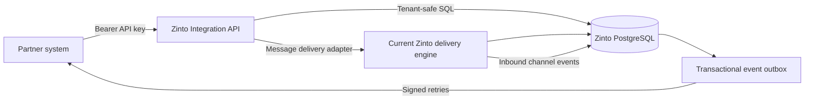

# Zinto Integration API Design

**Status:** Approved direction  
**API base:** `/api/v1`  
**Architecture:** Standalone service alongside the recovered CRM

## Product objective

An external company integrates once with Zinto's contract. It must not require
Zinto to implement customer-specific behavior. A conforming client can create
and update contacts, select a channel, send and receive messages, synchronize
notes and tags, operate pipelines and tasks, and receive changes made inside
Zinto.

The contract remains stable while Zinto replaces the recovered compiled
application module by module.

## System boundary

The Integration API is a new source-owned service, not a modification of
`dist/index.js`.



## Compatibility approach

- Reads and safe domain writes use explicit PostgreSQL repositories with a
  mandatory `company_id` boundary.
- Channel actions such as sending WhatsApp, email, or social messages use an
  adapter to the current delivery engine. The Integration API must never open a
  second WhatsApp socket for an already active account.
- Database triggers or equivalent transactional writes populate a Zinto-owned
  outbox whenever synchronized entities change, including changes made by the
  current CRM.
- When a reconstructed module replaces legacy behavior, only its internal
  adapter changes; external API clients keep the same contract.

## Authentication and authorization

- Clients send `Authorization: Bearer pcp_<secret>`.
- Only a SHA-256 hash is stored; plaintext keys are returned once at creation.
- Every key belongs to exactly one company.
- Scopes are resource/action based, for example `contacts:read`,
  `contacts:write`, `messages:send`, `conversations:read`, `notes:write`, and
  `webhooks:manage`.
- A wildcard is permitted only for explicitly trusted company administrators.
- Optional IP allowlists, expiration, revocation, and per-minute/hour/day limits
  reuse the existing API tables.
- Tenant identity always comes from the authenticated key, never from a
  client-supplied `company_id`.

## Contract conventions

### Responses

Successful singular response:

```json
{
  "data": {
    "id": "1272",
    "type": "contact",
    "attributes": {}
  },
  "meta": {
    "request_id": "req_..."
  }
}
```

Collection response:

```json
{
  "data": [],
  "meta": {
    "request_id": "req_...",
    "next_cursor": null,
    "has_more": false
  }
}
```

Error response:

```json
{
  "error": {
    "code": "validation_error",
    "message": "The request is invalid",
    "details": [],
    "request_id": "req_..."
  }
}
```

### Pagination and filtering

- Cursor pagination is used for mutable collections.
- Default page size is 50 and maximum page size is 200.
- Dates use UTC ISO 8601.
- Filters are explicit query parameters and unknown parameters are rejected.
- Deleted records use soft-delete/tombstone semantics where synchronization
  requires downstream deletion.

### Idempotency

- `Idempotency-Key` is required for message sends and recommended for every
  create operation.
- A key is scoped to API key, HTTP method, and route.
- Repeating the same request returns the original result.
- Reusing a key with a different payload returns `409 idempotency_conflict`.

## Webhooks

- Clients register one or more HTTPS endpoints and select event types.
- Each event has an immutable event ID, company-scoped sequence, type, schema
  version, occurrence time, and resource payload.
- Delivery includes `X-Zinto-Event-Id`, `X-Zinto-Timestamp`, and
  `X-Zinto-Signature`.
- The signature is HMAC-SHA256 over `<timestamp>.<raw-body>`.
- Receivers should reject timestamps outside a five-minute tolerance and store
  event IDs to deduplicate deliveries.
- `2xx` acknowledges delivery. Timeouts and non-`2xx` responses are retried with
  exponential backoff and jitter.
- Dead-lettered deliveries remain visible and can be replayed.
- Events are at-least-once and ordered per company where feasible; consumers
  must be idempotent.

Initial event families:

- `contact.created`, `contact.updated`, `contact.deleted`
- `conversation.created`, `conversation.updated`
- `message.created`, `message.status.updated`
- `note.created`, `note.updated`, `note.deleted`
- `tag.attached`, `tag.detached`
- `deal.created`, `deal.updated`, `deal.stage.changed`, `deal.deleted`
- `task.created`, `task.updated`, `task.completed`, `task.deleted`
- `channel.connection.updated`

## Resource coverage

### Foundation release

- Health and authenticated identity.
- Channels and channel capabilities.
- Contacts, notes, and tags.
- Conversations and complete paginated message history.
- Text/media/template message submission through the delivery adapter.
- API keys, scopes, usage, rate limits, idempotency, and webhooks.
- OpenAPI 3.1 specification and integration guide.

### CRM release

- Pipelines, stages, deals, assignments, activities, and stage changes.
- Tasks, categories, appointments, users, teams, and agents.
- Quick replies, templates, scheduled messages, follow-ups, and campaigns.
- Custom fields, captured data, search, imports, and exports.

### Automation and channel release

- Flows, assignments, executions, variables, and webhook triggers.
- Email, WhatsApp, Meta WhatsApp, Instagram, Messenger, Telegram, TikTok,
  webchat, and voice capabilities represented through a unified channel model.
- Calendar integrations and call logs.

### Extended business release

- Reporting and analytics.
- ERP resources selected for public business integration: products, inventory,
  suppliers, purchase orders, sales orders, invoices, accounting, HR, payroll,
  currencies, tax, restaurant, and dental modules.

Super-administrator operations, provider secrets, raw OAuth tokens, backups,
impersonation, security debug endpoints, and infrastructure controls are not
customer API resources.

## Data safety

- All repository methods require authenticated tenant context.
- SQL statements include the tenant boundary even when IDs are globally unique.
- Cross-company resource references return `404` to avoid disclosing existence.
- Input schemas reject unknown fields.
- Secrets, provider tokens, internal metadata, and deleted personal data are
  never serialized.
- Mutations write an audit record and outbox event in the same transaction.
- Logs redact authorization, cookies, message media credentials, and personal
  data where possible.

## Operational model

- The service has its own container, health checks, migrations, and deployment
  lifecycle.
- Production rollout starts read-only, then enables mutations resource by
  resource after contract and integration tests pass.
- A staging restore of production-like data is used for validation; tests never
  send to real customer channels.
- Metrics include request rate, latency, errors, rate-limit rejections, outbox
  lag, webhook retries, dead letters, and delivery-adapter failures.
- Future releases come only from Zinto-controlled Git and CI/CD.

## Acceptance criteria

The foundation is accepted when two independent test clients can:

1. Authenticate with different companies and cannot access each other's data.
2. Create a contact and see it in Zinto.
3. Send a message through a selected authorized channel.
4. Receive the resulting message and status events by signed webhook.
5. Observe an inbound customer response in both Zinto and the external client.
6. Synchronize contact changes, notes, and tags in both directions without
   duplicates.
7. Rebuild the service and its documentation from this repository.
