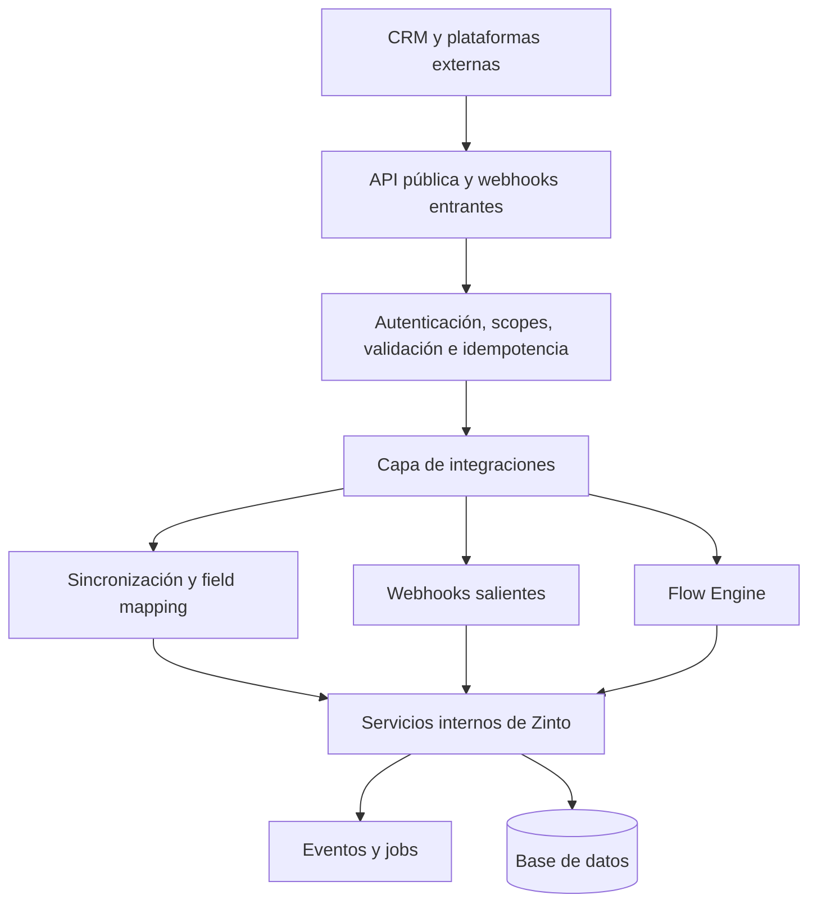

# Plataforma de integraciones de Zinto

Esta carpeta reunirá la documentación verificable de la API pública, webhooks, conectores, sincronizaciones y motor de Flows de Zinto CRM.

## Objetivo

Permitir que Zinto se comunique con otros CRM y plataformas sin:

- Crear registros duplicados.
- Perder actualizaciones.
- Mezclar datos entre empresas.
- Generar bucles de sincronización.
- Repetir operaciones críticas.
- Romper integraciones al actualizar la aplicación.
- Ocultar errores o fallos de entrega.

## Documentos previstos

| Archivo | Propósito |
|---|---|
| `00-version-y-alcance.md` | Commit, rama, tecnologías y alcance analizado |
| `01-estado-actual.md` | Inventario verificable del sistema |
| `02-api-actual.md` | Endpoints existentes y sus fuentes |
| `openapi-current.yaml` | Contrato OpenAPI generado desde el código real |
| `03-modelo-canonico.md` | Entidades y formato común de integración |
| `04-seguridad-multitenant.md` | Aislamiento por empresa y riesgos |
| `05-sincronizacion-y-conflictos.md` | IDs externos, dedupe y conflictos |
| `06-webhooks-y-eventos.md` | Catálogo de eventos y entregas |
| `07-arquitectura-conectores.md` | Framework común para proveedores |
| `08-flow-engine.md` | Diseño y ejecución segura de Flows |
| `09-errores-observabilidad.md` | Errores, logs, métricas y trazabilidad |
| `10-plan-pruebas.md` | Pruebas unitarias, contrato, E2E y tenant |
| `11-roadmap.md` | Fases incrementales y reversibles |

## Flujo técnico objetivo

## Reglas de evidencia

Toda documentación sobre comportamiento existente debe incluir:

`Fuente: ruta/archivo.ext:LÍNEA_INICIO-LÍNEA_FIN — símbolo`

Las funciones no implementadas deben marcarse como propuesta. Nunca deben presentarse como disponibles.

## Criterios mínimos para declarar una integración lista

1. Está aislada por empresa.
2. Sus credenciales están cifradas y pueden revocarse.
3. Utiliza servicios internos de Zinto.
4. Tiene IDs internos y externos persistentes.
5. Soporta idempotencia donde corresponda.
6. Deduplica webhooks y jobs.
7. Evita bucles de sincronización.
8. Clasifica errores temporales y permanentes.
9. Tiene timeout, rate limiting y retry controlado.
10. Incluye logs y correlation IDs.
11. Tiene pruebas multitenant y de contrato.
12. Está documentada con fuentes del código.
